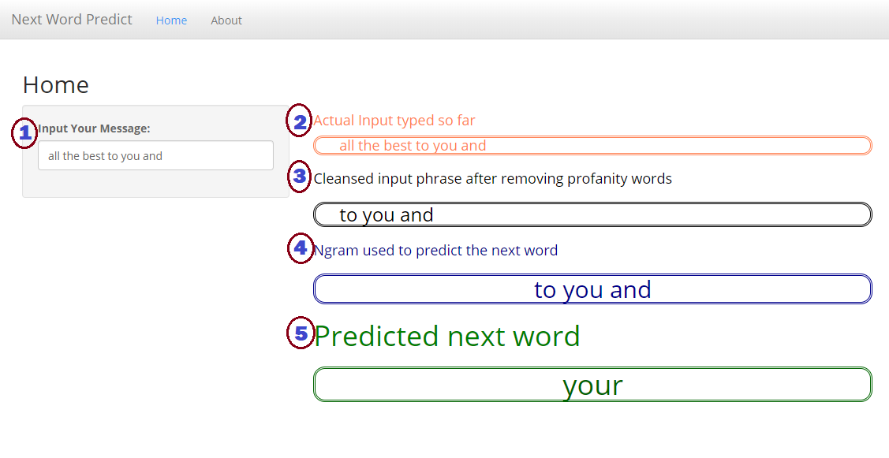

Next Word Predict
========================================================
author: Kadiresan Dhanasekaran
date: 26-Jan-2020
autosize: true
transition: rotate

Johns Hopkins University 
Capstone Project for Data Science Specialization 

Executive Summary
========================================================

<link rel="stylesheet" href="https://stackpath.bootstrapcdn.com/bootstrap/4.1.3/css/bootstrap.min.css" integrity="sha384-MCw98/SFnGE8fJT3GXwEOngsV7Zt27NXFoaoApmYm81iuXoPkFOJwJ8ERdknLPMO" crossorigin="anonymous">

**Capstone Project Objective:**

<ul>
<li>Predict the next word that the user might type</li>
<li>Develop a Machine Learning Model using Natural Language Processing</li>
<li>Use the Swiftkey dataset for Model creation</li>
</ul>

**Shiny App Location:**

<ul>
    <li><a target="_blank" href="https://kamkadir17.shinyapps.io/capstonPredictWord">https://kamkadir17.shinyapps.io/capstonPredictWord/</a></li>
</ul>

**GitHub Source Code Location:**

<ul>
    <li><a target="_blank" href="https://github.com/kamkadir17/jhp_capstoneproject">https://github.com/kamkadir17/jhp_capstoneproject</a></li>
</ul>

About Shiny App
========================================================
The app has a model built via supervised NLP processing using Swiftkey dataset.  This dataset contains data from twitter feeds, news articles and blog posts.

As the user types in the textbox, the app 
* cleans the input to remove data that doesn't add any value
* tokenizes the input to feed the ngram model
* extracts the last `(n=3)` grams to predict the next word
* recursively finds the next word based on the given `(n)` or `(n-1)` or `(n-2)` gram
* If no match, displays "No Prediction"

Machine Learning Model
========================================================

* Corpus tokenized & model built using Quanteda package
* Bigram, Trigram & Quadgram tokens are created out of the corpus
* Take n-1 grams from the above to predict the nth gram
* Create a model data of top nth gram occurrence for the given `(n-1)` grams
* Model created with bi/tri/quad combinations with frequency `>=5` for performance reasons

**Example:**
* Bigram:  "of the" occurs max for the unigram "of"
* Trigram:  "wish you were" occurs max for the bigram "wish you"

Application User Interface
========================================================

  

  <b>Input:</b> 
          <ul style="list-style: none; padding: 0; margin: 0;">
            <li>&nbsp;1&nbsp;
    Enter a word or pharse</li>
          </ul> 
          <b>Output:</b> 
          <ul style="list-style: none; padding: 0; margin: 0;">
          <li>&nbsp;2&nbsp;
  Simple replay of what has been typed</li>
          <li>&nbsp;3&nbsp;Replay of what is typed sans profanity words</li>
          
          </ul>
  

  

          
  
  

 

  <ul style="list-style: none; padding: 0; margin: 0;">
        <li>&nbsp;4&nbsp;Last n-grams that were actually used for the given scenario to predict</li>
        <li>&nbsp;5&nbsp;The actual word that was predicted using the n-grams mentioned above</li>
        </ul>
 

